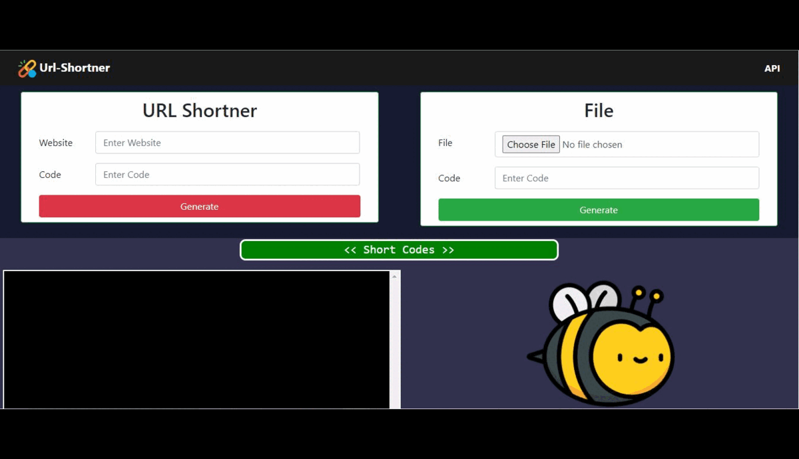

# URL SHORTENER
Url-Shortener simplifies lengthy web addresses, creating shorter and more organized links that are easier to share.
<p align="left"></p>

# Build Steps
### Step1: open pipenv
```cmd
pipenv shell
```

### Step2: install dependencies
```cmd
pipenv install
```

### Step3: run on local host
```cmd
flask run
```

### Step3: available to other(PAN)
```cmd
flask run --host 0.0.0.0
```
